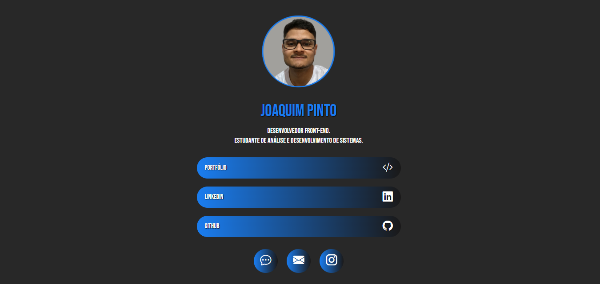

# bio-links
 📌 Projeto desenvolvido semelhante ao Linktree. Uma página voltada para colocar os seus links de redes sociais e contato.
 
 🎨 Página inspirada no projeto desenvolvido pelo <a href="https://github.com/brunorodris">Bruno Rodrigues</a>. Link do vídeo para assistir: <a href="https://www.youtube.com/watch?v=hxUdJRqa21k&list=WL&index=15">clique aqui</a>

 ✅ Tecnologias utilizadas: HTML5, CSS3 & Bootstrap.

 🔗 <a href="https://joaquimsp.github.io/bio-links/">Clique aqui para visitar o projeto</a>

